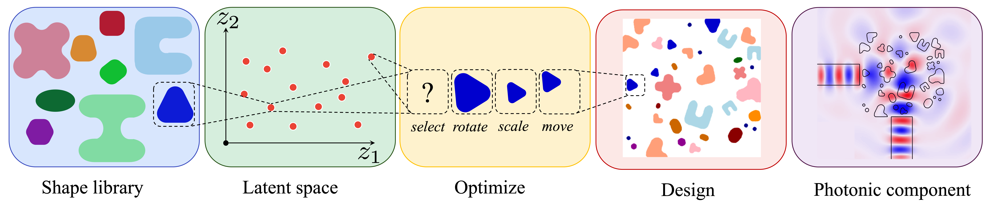

# [PhoTOS: Topology Optimization of Photonic Components using a Shape Library](https://arxiv.org/abs/2407.00845)

[Rahul Kumar Padhy](https://sites.google.com/view/rahulkp/home), [Aaditya Chandrasekhar](https://www.aadityacs.com/)


## Abstract

Topology Optimization (TO) holds the promise of designing next-generation compact and efficient photonic components. However, ensuring the optimized designs comply with fabrication constraints imposed by semiconductor foundries remains a challenge. This work presents a TO framework that guarantees designs satisfy fabrication criteria, particularly minimum feature size and separation. Leveraging recent advancements in machine learning and feature mapping methods, our approach constructs components by transforming shapes from a predefined library, simplifying constraint enforcement. Specifically, we introduce a Convo-implicit Variational Autoencoder to encode the discrete shape library into a differentiable space, enabling gradient-based optimization. The efficacy of our framework is demonstrated through the design of several common photonic components.



## Shape data

Shape images and trained VAE params required for the code can be downloaded from this [link](https://drive.google.com/drive/folders/10vXswqDAJsqBip-ztR85OXR37FGCrQRT?usp=sharing).

## Citation

```

@article{padhy2024photos,
  title={{PhoTOS}: topology optimization of photonic components using a shape library},
  author={Padhy, Rahul Kumar and Chandrasekhar, Aaditya},
  journal={Engineering with Computers},
  pages={1--13},
  year={2024},
  publisher={Springer}
}
```

## 3rd party libraries
[invrs-io/gym](https://github.com/invrs-io/gym)

[totypes](https://github.com/invrs-io/totypes)

[ceviche](https://github.com/fancompute/ceviche)

[imageruler](https://github.com/NanoComp/imageruler)

[mmapy](https://github.com/aadityacs/mmapy)

[gifcm](https://github.com/mfschubert/gifcm)
